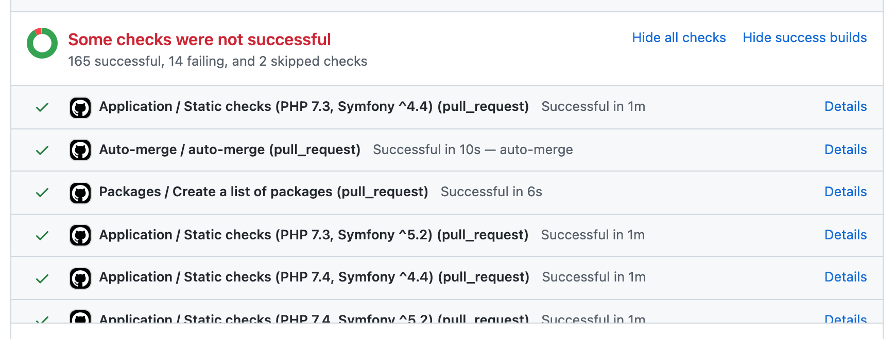

## Toggle GitHub Builds
#### Chrome Extension 

  

This Chrome extension allows to easily hide or show success builds on Github Pull Requests.
Handy, if you have tens/hundreds of builds and cannot determine which failed at the first sight.

#### Shown

#### Hidden

#### Hidden (all)

