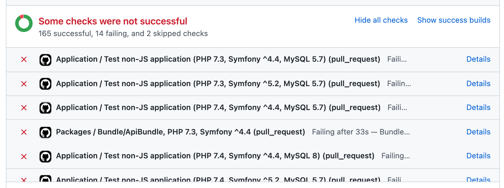

## Toggle GitHub Builds
#### Chrome Extension 

  

This Chrome extension allows to easily hide or show success builds on Github Pull Requests.
Handy, if you have tens/hundreds of builds and cannot determine which failed at the first sight.

#### Shown

#### Hidden

#### Hidden (all)

### Installation

1. Download this repo as a [ZIP file](https://github.com/Zales0123/ToggleGithubBuildsExtension/archive/v0.1.0.zip)
1. Unzip the file
1. In Chrome go to the extensions page (`chrome://extensions`)
1. Enable Developer Mode
1. Load the extension's folder

### License

Extension is completely free and released under the [MIT License](https://github.com/Zales0123/ToggleGithubBuildsExtension/blob/master/LICENSE).
